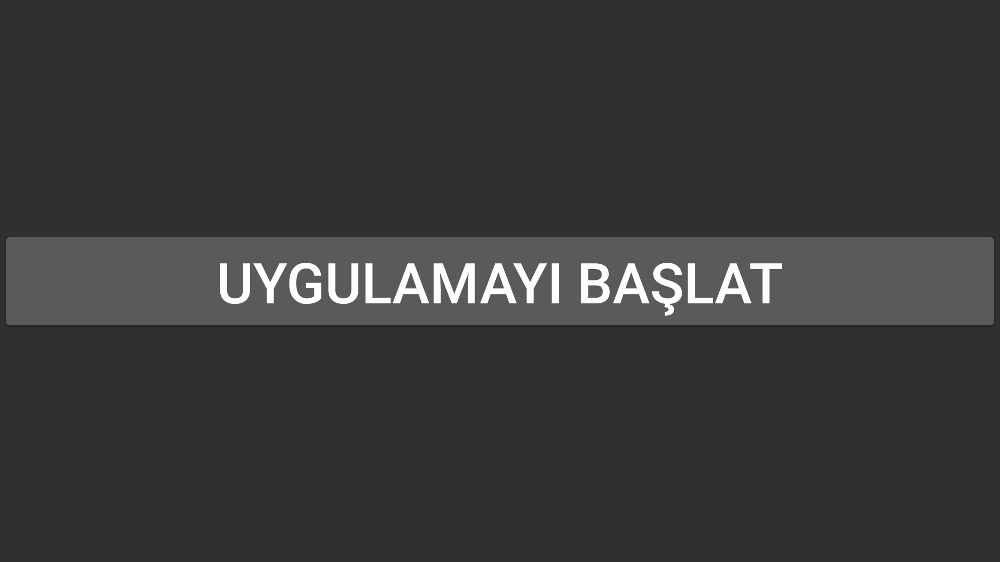
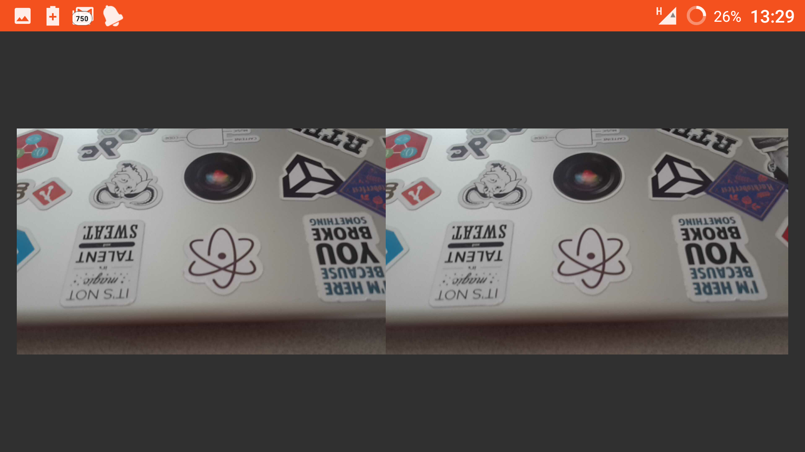
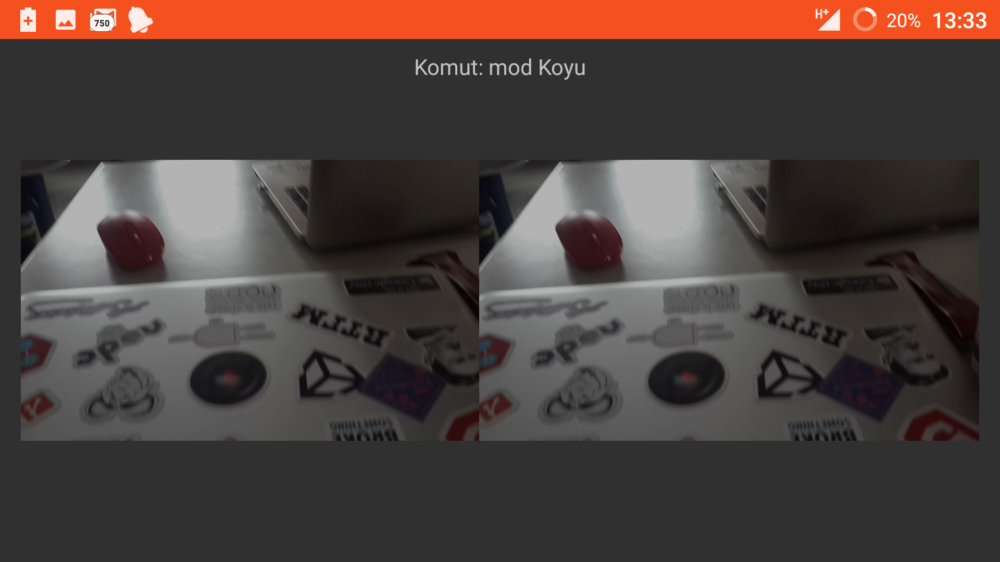
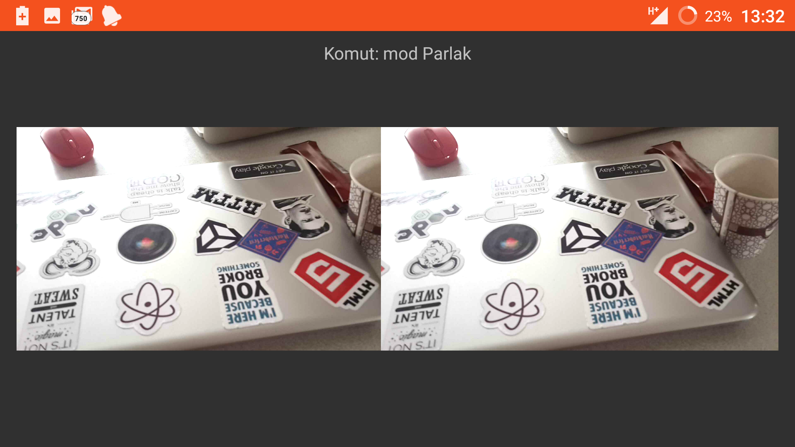
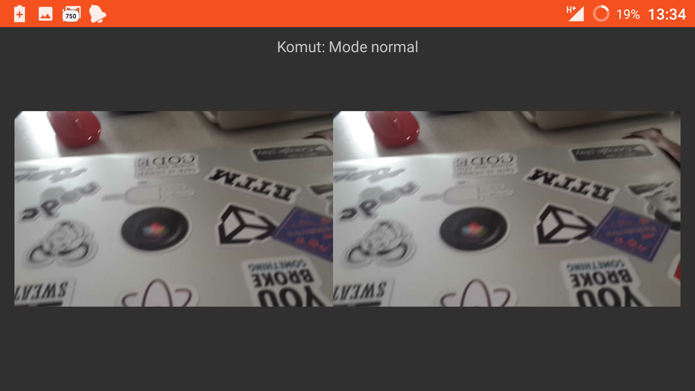
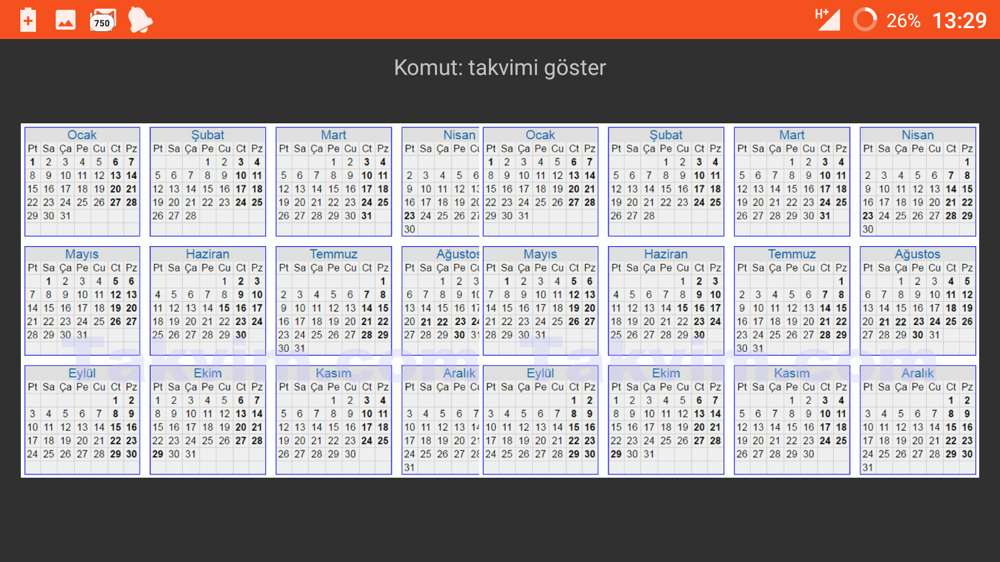
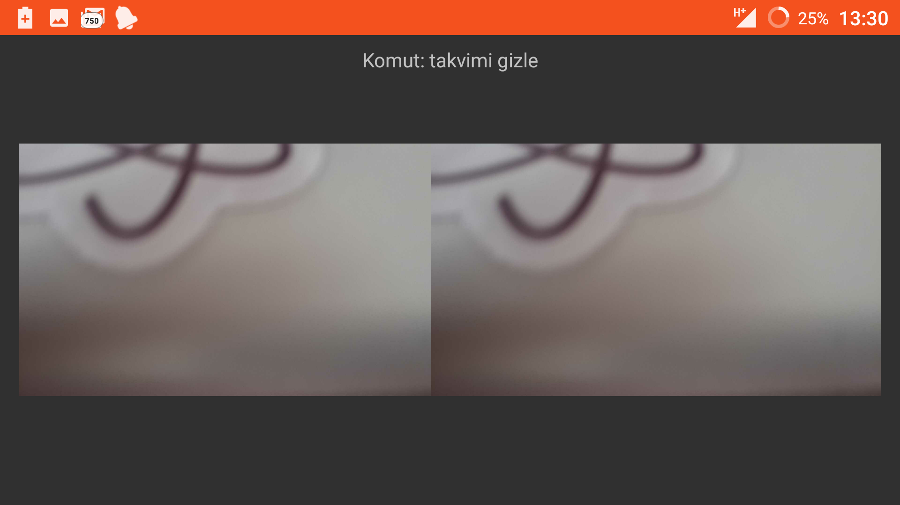

# VRLife
A lifestyle app for VR on Cardboard...

This is my first seasonal project for my project lesson.

My purpose is use the VR to make life easier.

For now you can use only several functions of app. But i will 
improve it.

--------------------

# Functions

|Command      |Description                      |
|-------------|---------------------------------|
|mod koyu     |It makes camera view darker...   |
|mod parlak   |It makes camera view brighter... |
|takvimi ac   |Open the calendar in VR View...  |
|takvimi gizle|Close the calendar...            |

---------------------

#Screenshots

